# Propuesta de implementación: reingreso hospitalario con SageMaker AI

**Estado:** diseño listo para planificación de implementación, sujeto a validación de datos, seguridad y uso clínico. Amplía la [propuesta A](../PROPUESTAS_DESPLIEGUE_AWS.md). Los horarios y el margen de maduración son valores iniciales de operación, ajustables tras medir el flujo real del hospital. Todas las horas indicadas usan `America/Lima`.

## 1. Decisiones de arquitectura

- **Predicción al alta:** API Gateway REST privada, Lambda de contrato/características y endpoint SageMaker AI de inferencia en tiempo real. Dos instancias mínimas del endpoint, autoescalado y conexión privada desde la VPC. La respuesta es una ayuda a la decisión clínica; un fallo de infraestructura o de datos deriva a revisión humana, nunca a una clasificación de bajo riesgo por defecto.
- **Intercambio de datos:** como contrato inicial, el hospital entrega diariamente por SFTP privado (AWS Transfer Family con endpoint interno de VPC sobre VPN o Direct Connect) lotes de altas y de admisiones posteriores a S3. Si el hospital dispone de otra integración aprobada, se sustituye solo el adaptador de entrada. AWS documenta endpoints internos de Transfer Family para redes conectadas a VPC y almacenamiento en S3 ([Transfer Family en VPC](https://docs.aws.amazon.com/transfer/latest/userguide/create-server-in-vpc.html)).
- **Fuente de verdad y cómputo:** S3 versionado para eventos crudos, características/predicciones, etiquetas maduras, conjuntos de entrenamiento y reportes. SageMaker Processing prepara datos y calcula métricas; SageMaker Training entrena; SageMaker Pipelines orquesta y Model Registry versiona candidatos. La capa online de historial del paciente se mantiene en DynamoDB y se alimenta de eventos validados con sello de disponibilidad; la preparación offline reconstruye el mismo estado a cada fecha de corte.
- **Monitoreo:** jobs propios de PSI, KS, χ², desempeño y equidad. SageMaker Model Monitor ya no admite nuevos clientes según [AWS](https://docs.aws.amazon.com/sagemaker/latest/dg/how-it-works-model-monitor.html); el diseño no depende de él.
- **Promoción:** ninguna alerta activa un modelo nuevo sin evaluación, aprobación de ML y clínica, prueba en sombra/canario y verificación de alarmas. El endpoint puede actualizarse con despliegue gradual y reversión por alarmas de CloudWatch ([guardrails de SageMaker](https://docs.aws.amazon.com/sagemaker/latest/dg/deployment-guardrails.html)).

## 2. Flujo de datos e inferencia

Versión editable del diagrama de arquitectura: [arquitectura_sagemaker.drawio](arquitectura_sagemaker.drawio). Se puede abrir en diagrams.net / draw.io y usa los iconos nativos de su biblioteca AWS para los servicios de la propuesta.

```mermaid
flowchart LR
    H[Historia clínica hospitalaria] -->|Alta: datos disponibles y hora de corte| API[API Gateway REST privada]
    API --> L[Lambda: contrato y características]
    L <-->|Historial conocido antes del alta| DDB[(DynamoDB)]
    L -->|InvokeEndpoint privado| EP[SageMaker AI: endpoint 2 o más instancias]
    EP --> L --> R[Respuesta al equipo clínico]
    L -->|Predicción y metadatos seudónimos| P[(S3: predicciones)]

    H -->|Lotes diarios de altas, admisiones y correcciones| SFTP[Transfer Family SFTP interno]
    SFTP --> RAW[(S3: eventos crudos)]
    RAW --> VAL[Validación e ingesta diaria]
    VAL --> CUR[(S3: eventos curados)]
    VAL --> DDB
    CUR --> LAB[Conciliación a 30 días y maduración]
    P --> LAB
    LAB --> Y[(S3: etiquetas y cohortes)]

    CUR --> DX[Job semanal de PSI, KS y chi cuadrado]
    P --> DX
    Y --> PERF[Job mensual de desempeño y equidad]
    P --> PERF
    DX --> AL[CloudWatch: alarmas]
    PERF --> AL
    AL -->|Investigación o corrida extraordinaria| PIPE

    Y --> PIPE[SageMaker Pipeline mensual E3]
    CUR --> PIPE
    PIPE --> TRAIN[Processing y Training: 3 ventanas maduras]
    TRAIN --> EVAL[Validación temporal y clínica]
    EVAL --> REG[Model Registry: pendiente]
    REG --> APR[Aprobación ML y clínica]
    APR --> DEP[CI/CD: canario y rollback]
    DEP --> EP
```

El diagrama representa dos relojes: inferencia al alta y conocimiento tardío del reingreso. El registro de inferencia no contiene un `target` definitivo; la unión posterior usa identificadores seudónimos y fechas de evento. La referencia que vincula un ID seudónimo con una identidad clínica se conserva en el sistema hospitalario o en un almacén de acceso muy restringido, separado de los datos analíticos. La Lambda comprueba la frescura del historial online: si los eventos necesarios aún no llegaron al lote diario, pide una instantánea vigente al sistema hospitalario o remite el caso a revisión humana; no imputa silenciosamente un historial desactualizado.

## 3. Ingesta y maduración de las etiquetas

### Contrato con el hospital

Cada entrega lleva `source_system`, `batch_id`, versión de esquema, fecha de extracción, período cubierto, conteo de registros, hash y marca `snapshot`/`delta`. El fichero de altas incluye ID estable de paciente y episodio, hora real de alta, datos clínicos disponibles en esa hora y correcciones. El fichero de admisiones incluye ID de paciente/episodio, hora de nueva admisión, fuente y correcciones/anulaciones. El hospital debe especificar si captura reingresos en otras sedes; si no puede observarlos, la ausencia de evento **no** demuestra ausencia de reingreso. Se acuerdan además zona horaria, definición de reingreso, casos excluidos y políticas para duplicados/transferencias antes de generar etiquetas. Esos acuerdos son parte del contrato de datos, no se pueden deducir del CSV histórico.

La carga aterriza sin modificar en `raw/altas/` y `raw/admisiones/`, con cifrado SSE-KMS, versionado y acceso separado por fuente. Un manifest completo señala cuándo un lote está listo: un evento de llegada despierta la validación; el horario diario actúa como conciliación de entregas faltantes. SageMaker Processing verifica manifest/hash, tipos, fechas, conteos, IDs duplicados y cobertura. Los lotes inválidos pasan a cuarentena y generan aviso; el watermark de datos aceptados solo avanza tras completar la validación. La ingesta es idempotente por `source_system + batch_id + ID de episodio + versión de corrección`. Se retiene el evento original y una vista curada reproducible, con historial de rectificaciones. La tabla online de DynamoDB se actualiza después de aceptar el lote y nunca incorpora hechos posteriores a la hora de una inferencia histórica.

### Construcción de `target` y control de fugas

Para cada alta elegible, el proceso de conciliación busca la primera admisión que satisfaga la definición aprobada dentro de los 30 días posteriores. Es `1` si la admisión está confirmada. Para publicar `0`, deben haber transcurrido **30 días + 7 días iniciales de margen de llegada tardía**, y la fuente debe certificar cobertura suficiente hasta la fecha final. El margen de 7 días es una **hipótesis operativa inicial**, no un resultado del notebook; se ajusta a la distribución observada de retrasos y al SLA del hospital. Episodios con cobertura incompleta, identidad incierta, transferencias ambiguas o correcciones pendientes quedan `pendiente/no_evaluable`, nunca `0` por ausencia de registro. La conciliación diaria vuelve a procesar al menos los últimos 90 días; una corrección de un episodio más antiguo fuerza el reproceso de ese episodio y versiona la etiqueta modificada.

Los datos de entrenamiento usan un corte de conocimiento explícito: características visibles al alta y etiquetas confirmadas **antes del inicio del entrenamiento**. Para reconstruir variables como `prev_readmit30`, se usa la etiqueta de un episodio previo solo si ya era conocible en la fecha de la nueva alta. El embargo histórico de 2.000 `encounter_id` del notebook se reemplaza por cortes de fecha; el test futuro queda separado del entrenamiento y de la selección de calibración. La tabla de cohortes guarda fecha de alta, fecha límite de etiqueta, estado de cobertura, versión de reglas y versión de cada fuente. No se entrenará si falla la completitud o la cobertura mínima acordada.

### Cadencia propuesta

| Tarea | Inicio en `America/Lima` | Insumo y resultado | Si falta el dato |
|---|---|---|---|
| Entrega del hospital | Diaria, comprometida antes de 01:00 | Lotes incrementales de altas, admisiones y rectificaciones del día anterior | Aviso por atraso; no inventar negativos |
| Validación e ingesta | Diaria, 02:00; además al manifest completo | Lotes curados, watermark y actualización del historial online | Cuarentena; reintentos idempotentes |
| Conciliación de etiquetas | Diaria, 03:00 | Reprocesa 90 días; publica positivos y negativos maduros | Mantiene `pendiente/no_evaluable` |
| Calidad del flujo | Diaria, 04:00 | Volumen, completitud, atraso, duplicados, cobertura y estado de jobs | Alarma operativa y suspensión de downstream afectado |
| Drift de X | Lunes, 05:00, sobre 28 días recientes | PSI/KS/χ² y comparación con referencia vigente; no necesita etiquetas | `sin_datos_suficientes`, sin alerta estadística espuria |
| Desempeño y equidad | Día 9 de cada mes, 05:00 | Última cohorte mensual completa y madura; ROC-AUC, PR-AUC, Brier, calibración, FNR y selección por subgrupo | Sin evaluación E4 basada en etiquetas; aviso |
| Candidato E3 | Día 10 de cada mes, 05:00 | Tres últimas cohortes mensuales completas y maduras; candidato en registro | Se omite y queda documentado; no usar cohortes parciales |

**Ejemplo:** el 10 de octubre, con demora de etiqueta 30+7 días, agosto es el mes completo más reciente que puede estar maduro; el candidato usaría junio–agosto si la cobertura pasa los controles. La mensualidad es una **propuesta para arrancar** y no significa que los tres bloques históricos sean meses. Un backtest con fechas y volumen locales debe confirmar que tres cohortes mensuales dan suficiente tamaño, desempeño y estabilidad; en caso contrario se modifica la duración de las ventanas y la frecuencia de reentrenamiento. E4 puede iniciar un candidato extraordinario tras una alerta, bajo el mismo control humano.

EventBridge Scheduler admite expresiones cron y zona horaria, así como reintentos y cola de mensajes fallidos ([recurso CloudFormation del scheduler](https://docs.aws.amazon.com/AWSCloudFormation/latest/TemplateReference/aws-resource-scheduler-schedule.html)); cada horario inicia una Step Functions o SageMaker Pipeline, no un script en un notebook. Configurar un máximo de una ejecución activa por proceso o control de bloqueo/idempotencia para evitar que una corrida atrasada se solape con la siguiente. Las fallas repetidas y el estado de la cola se alarman.

## 4. Entrenamiento, drift y despliegue

1. **Preparación y E3.** Una versión de código compartida aplica exclusiones y transformaciones del repositorio, con `USAR_CONTEXTO=False`. La ventana se construye con tres cohortes maduras y un manifiesto de datos/hash; el pipeline conserva conjunto posterior no visto para evaluación. El modelo, calibrador, codificadores, réplicas de incertidumbre y reglas de decisión se empaquetan juntos. `resultados/fase3_modelo.json` solo informa la configuración inicial y no sustituye ese artefacto.
2. **Detección.** En la ventana reciente, 8 numéricas y 9 categóricas se comparan con los bins y categorías de referencia mediante PSI más KS o χ², con Bonferroni según el número real de pruebas; `diag_1_grp` se calcula además para E4. PSI >0,25 en al menos 2 de las 5 variables clave, caída de ROC-AUC >0,03 con IC 95% no solapados, o pendiente fuera de [0,80, 1,20] abren revisión. El cálculo de desempeño solo usa etiquetas maduras. El job guarda tamaños muestrales y evidencia; un PSI aislado no prueba cambio del concepto clínico.
3. **Puerta de promoción.** EvaluationStep compara el candidato con modelo activo y baseline E1 en periodos futuros, además de Brier, PR-AUC, calibración, costo de intervención, incertidumbre y equidad. Model Registry queda en `PendingManualApproval`; se anexan versión de datos, código, imagen, resultados y aprobación de responsables de ML y clínica. El estado `Approved` puede activar CI/CD ([AWS Model Registry](https://docs.aws.amazon.com/sagemaker/latest/dg/model-registry-approve.html)). Para uso clínico se exige resolver la razón de selección ≈0,38 frente a ≥0,80, revisar Brier 0,0963 frente a ≤0,095 y dimensionar el 37,6% de casos de incertidumbre alta documentados en el repositorio.
4. **Salida.** CI/CD prueba el paquete y el contrato, despliega en sombra o canario, comprueba errores/latencia y aplica guardrails con alarmas. Mantiene la versión anterior para rollback. Los umbrales de riesgo y el cupo del 15% son una política clínica/versionada aparte del score; un cupo global requiere cohortes y capacidad de intervención conocidas, por lo que no se improvisa dentro de una llamada individual al endpoint.

## 5. Recursos que hay que crear

| Capa | Recursos a crear |
|---|---|
| Red y entrada | VPC en 2 zonas, conexión privada con el hospital, VPC endpoints y API Gateway REST privada |
| Ingesta | Transfer Family SFTP interno, identidad por fuente, S3 `raw` y cuarentena |
| Datos | S3 para datos curados, predicciones, etiquetas, datasets, artefactos y reportes; DynamoDB para historial online |
| Inferencia | Lambda, SageMaker Model, EndpointConfig, Endpoint y Application Auto Scaling |
| ML | ECR, SageMaker Pipeline, ModelPackageGroup y jobs de Processing/Training |
| Orquestación | Step Functions y EventBridge Scheduler |
| Seguridad y operación | KMS, IAM, Secrets Manager, CloudWatch, SQS DLQ, CloudTrail y CI/CD |

**Configuración esencial por capa:**

- **Red y entrada:** subredes privadas en ambas zonas; VPN o Direct Connect; endpoints privados para API Gateway, SageMaker Runtime/API y los servicios a los que deban acceder Lambda y los jobs. Restringir rutas, DNS, grupos de seguridad, políticas de recurso y autenticación entre sistemas.
- **Ingesta y datos:** permisos de escritura por fuente y validación de manifest/hash; cifrado SSE-KMS, versionado, retención, copias de seguridad y registro de rectificaciones. Aplicar políticas de acceso distintas a datos crudos, etiquetas y artefactos. Definir TTL de DynamoDB solo si preserva el historial necesario.
- **Inferencia y ML:** mínimo 2 instancias de endpoint, escalado definido tras prueba de carga, alarmas de latencia y errores, e imagen/artefacto inmutables. Versionar el corte temporal, código y datos de cada ejecución; impedir corridas solapadas y exigir aprobación antes de promoción.
- **Seguridad y operación:** roles por tarea, secretos fuera del código, logs sin datos clínicos, cola de mensajes fallidos, alarmas por ausencia de datos o fallas de jobs y procedimiento probado de recuperación y reversión.

Los jobs de SageMaker son efímeros: se crean durante cada ejecución, no como máquinas permanentes. Separar entornos de desarrollo, validación y producción, con cuentas y claves distintas cuando la organización lo permita. Verificar disponibilidad regional, cuotas, costos y obligaciones de residencia/privacidad antes de fijar la región. Si aplica HIPAA, AWS exige acuerdo BAA para PHI y uso de servicios elegibles ([lista oficial](https://aws.amazon.com/compliance/hipaa-eligible-services-reference/)); la elegibilidad del servicio no sustituye el diseño de controles del hospital.

## 6. Viabilidad de CloudFormation y AWS SAM

**CloudFormation: sí, es viable y es la opción principal para la infraestructura de esta propuesta.** AWS expone recursos para [SageMaker Pipeline](https://docs.aws.amazon.com/AWSCloudFormation/latest/TemplateReference/aws-resource-sagemaker-pipeline.html), [Endpoint y su configuración de despliegue](https://docs.aws.amazon.com/AWSCloudFormation/latest/TemplateReference/aws-resource-sagemaker-endpoint.html), [ModelPackageGroup](https://docs.aws.amazon.com/AWSCloudFormation/latest/TemplateReference/aws-resource-sagemaker-modelpackagegroup.html), [Transfer Family Server](https://docs.aws.amazon.com/AWSCloudFormation/latest/TemplateReference/aws-resource-transfer-server.html), [EventBridge Scheduler](https://docs.aws.amazon.com/AWSCloudFormation/latest/TemplateReference/aws-resource-scheduler-schedule.html) y [autoescalado de variantes SageMaker](https://docs.aws.amazon.com/AWSCloudFormation/latest/TemplateReference/aws-resource-applicationautoscaling-scalabletarget.html), además de S3, KMS, IAM, VPC, Lambda, DynamoDB y alarmas. La definición del SageMaker Pipeline puede estar en JSON en S3, generado y versionado por el pipeline de CI ([referencia](https://docs.aws.amazon.com/AWSCloudFormation/latest/TemplateReference/aws-properties-sagemaker-pipeline-pipelinedefinition.html)). Conviene separar stacks de red/seguridad, datos, ML y endpoint, porque tienen ciclos de vida y permisos distintos.

**Límites de la plantilla:** no convierte notebooks en código desplegable, no crea datos etiquetados ni garantiza acceso al hospital, no valida la definición clínica de reingreso, no resuelve equidad y no sustituye el pipeline CI/CD. El primer endpoint necesita una imagen y un artefacto entrenado previamente: desplegar primero la infraestructura/pipeline, generar y aprobar un modelo inicial, y después crear el endpoint. Las versiones nuevas del Model Registry son resultados dinámicos del entrenamiento; no conviene modelar cada versión como recurso estático de CloudFormation. Definir un **único dueño de los cambios del endpoint**: si CI/CD lo actualiza por API fuera de la stack, habrá drift de CloudFormation; preferir que CI/CD actualice la stack/parámetro correspondiente o separar explícitamente el endpoint del control de la stack.

**AWS SAM: técnicamente posible, pero aporta poco como plantilla principal.** Una plantilla SAM puede mezclar recursos nativos CloudFormation con `AWS::Serverless::Function` y `AWS::Serverless::StateMachine` ([documentación SAM](https://docs.aws.amazon.com/serverless-application-model/latest/developerguide/sam-specification-template-anatomy.html)). Ayudaría a empaquetar la Lambda de inferencia y la orquestación, pero SageMaker, red, transferencia y almacenamiento seguirían descritos con recursos CloudFormation normales. Recomendación: CloudFormation para stacks de plataforma; usar SAM solo si el equipo ya lo usa para publicar el pequeño componente Lambda/Step Functions. No se incluye ninguna plantilla en esta propuesta.

## 7. Orden recomendado de implementación

1. Acordar contrato de eventos, cobertura de reingresos, identidad, latencia real, retención, región y métricas de aceptación con hospital y responsables clínicos.
2. Extraer notebooks a librería versionada y contenedores; demostrar equivalencia de preparación, predicción y métricas con los CSV del repositorio; crear paquete del modelo inicial.
3. Desplegar red, ingesta y almacenamiento en entorno de prueba; cargar datos históricos autorizados y medir retraso de etiquetas, cobertura, fugas y tamaño de tres cohortes mensuales.
4. Desplegar pipeline y jobs de monitoreo; ejecutar backtest por fechas reales y recalibrar margen de 7 días, duración de ventanas y cadencia.
5. Desplegar endpoint privado en modo sombra; hacer pruebas de carga, caída de una zona, recuperación, reintentos y rollback. Resolver bloqueantes de equidad y calidad; realizar piloto clínico supervisado antes de usar prioridades operativas.

## 8. Alertas y respuesta

Separar **incidentes técnicos y del modelo** de **avisos sobre pacientes**. CloudWatch recibe métricas y estados de jobs; sus alarmas y las reglas de EventBridge notifican mediante SNS al equipo de guardia y abren un incidente en el canal institucional acordado. Los mensajes, métricas y logs solo contienen IDs de ejecución, conteos y referencias seudónimas: no llevan identidad ni datos clínicos. SQS DLQ conserva fallos de entrega para reintento y conciliación. Los umbrales operativos siguientes son valores iniciales para el piloto y se ajustan con el SLA, la carga por hora y la línea base observada.

| Señal y comprobación | Gravedad y destinatario | Respuesta |
|---|---|---|
| Sonda de extremo a extremo cada 5 min; 2 fallos seguidos, menos de 2 instancias sanas, o error 5xx >1 % en 5 min con al menos 20 solicitudes | P1, guardia de plataforma y responsable clínico del servicio | Abrir incidente inmediato, revisar API/Lambda/endpoint y conectividad; activar revisión humana de las altas afectadas. Revertir un despliegue reciente si coincide con el fallo. |
| Latencia p95 >2 s durante 15 min con al menos 20 solicitudes; si hay menos, usar la sonda y no inferir p95 de una muestra mínima | P2, guardia de plataforma | Revisar saturación, tiempos de Lambda y autoescalado; escalar capacidad tras confirmar la causa. |
| Lote diario ausente a las 02:00 (una hora después del compromiso), manifest/hash/esquema inválido, watermark estancado o DLQ con mensajes | P2, integración de datos y contacto técnico del hospital | Solicitar reenvío o corrección; poner lote en cuarentena, mantener la versión válida anterior y pausar los jobs dependientes. Escalar como P1 si impide inferencia segura. |
| Cobertura de admisiones insuficiente, etiquetas maduras retrasadas o discrepancia relevante en conciliación diaria | P2, datos y ML; responsable clínico si afecta evaluación | Mantener episodios como `pendiente/no_evaluable`; bloquear evaluación o entrenamiento con esa cohorte y acordar reparación de la fuente. |
| PSI >0,25 en al menos 2 de las 5 variables clave en el job semanal, con tamaño muestral suficiente; KS/χ² aportan evidencia adicional | P2, ML y dueño clínico de datos | Investigar fuente, mezcla de pacientes y cambio de práctica; si procede, iniciar candidato extraordinario con etiquetas maduras. No promover automáticamente. |
| Caída de ROC-AUC >0,03 con IC 95 % no solapados, o pendiente de calibración fuera de [0,80, 1,20], en la evaluación mensual con etiquetas maduras | P2, ML y comité clínico; P1 si hay impacto clínico confirmado | Revisar cohortes, cobertura, sesgo y política de uso; decidir recalibración o reentrenamiento. Si el modelo activo deja de ser apto, pasar a revisión humana según el protocolo clínico. |
| FNR, selección o calibración por subgrupo fuera de límites clínicos aprobados, o fallo del entrenamiento, evaluación, aprobación, canario o rollback | P2, ML y clínica para equidad; plataforma para fallo técnico | Congelar promoción; revisar resultados por subgrupo y causa del fallo. Durante canario, usar alarmas de errores/latencia para revertir a la versión previa. |

Cada alerta debe tener responsable primario, suplente, acuse de recibo y escalamiento si no se atiende dentro del SLA pactado (propuesta inicial: P1 en 15 min y P2 en 4 h). Agrupar avisos repetidos por `batch_id`, job, versión de modelo y ventana; registrar apertura, diagnóstico, acción y cierre. Un estado `sin_datos_suficientes` genera aviso de cobertura, no una conclusión de ausencia de drift. Probar mensualmente la entrega de alertas y la reversión, y revisar semanalmente falsos positivos y avisos no atendidos.

La **alerta por paciente** se entrega como tarea en la historia clínica o cola de trabajo del hospital, vinculada al episodio y a la versión de la política clínica. Incluye riesgo, categoría de incertidumbre y motivo de revisión, con acceso limitado al equipo asistencial. Un caso de alto riesgo o alta incertidumbre según la política aprobada solicita revisión profesional; el equipo registra acuse, decisión y eventual anulación. CloudWatch/SNS solo supervisan el estado agregado de esa entrega; nunca sustituyen el circuito clínico ni envían PHI.

## 9. Estimación mensual de costos

### Volumen y supuestos

**Corrección de la unidad temporal:** el [dataset UCI](https://archive.ics.uci.edu/dataset/296/diabetes+130-us+hospitals+for+years+1999-2008) reúne **101.766 encuentros de 130 hospitales entre 1999 y 2008**. No contiene fecha de alta ni de admisión. En `01_ingesta.ipynb`/`03_preprocesamiento.ipynb`, los encuentros se ordenan por `encounter_id` y se reparten en **20 periodos de igual número de registros**; `04_modelado.ipynb` y `07_drift_monitoreo.ipynb` agrupan dos periodos consecutivos por bloque (`bloque = period // 2 + 1`). Por tanto, los **10 bloques representan aproximadamente el horizonte de 10 años**, y cada bloque se puede tratar **solo de forma nominal como cerca de un año**, nunca como un mes calendario ni como un año concreto identificable. Como la densidad de encuentros varía, ni siquiera su duración anual exacta se puede verificar.

Los ocho bloques de prueba E1 de [`resultados/experimentos_E1_E4.csv`](../resultados/experimentos_E1_E4.csv) suman **59.478 evaluaciones**, media **7.434,75 por bloque** (rango 5.946–7.979). El conteo es correcto, pero **no mide las altas por bloque**: a cada uno se le restan 2.000 encuentros por el embargo de evaluación y B6/B8 ya tenían menos registros por los embargos en los cortes de entrenamiento/validación. No se debe convertir esta media directamente a consultas mensuales.

Para un escenario histórico ilustrativo se usan los **99.340 encuentros elegibles** tras las exclusiones del notebook, divididos entre **120 meses del horizonte 1999–2008**: **828 predicciones/mes** redondeadas y **1.656 predicciones/mes** al doble. Es una media de **todos los hospitales juntos**, no una previsión de un hospital individual ni un dato mensual medido. El presupuesto de producción debe recalcularse con el número de altas elegibles por mes y por sede que aporte el hospital, incluida su concentración por hora. Se supone una consulta por alta elegible, respuesta pequeña, 2 GB/mes de archivos SFTP en el escenario base y 4 GB al doble; estos tamaños de archivo también son supuestos. Reintentos y consultas duplicadas pueden aumentar las llamadas sin aumentar las altas.

Referencia de cálculo (consulta de precios: **20 de septiembre de 2026**): mes de 30 días (720 h), USD, pago bajo demanda sin capa gratuita ni descuentos, región **US East** como ejemplo de tarifas públicas; la región real depende de residencia de datos y aprobación del hospital. Se supone 1 endpoint SageMaker con **2 instancias `ml.c5.xlarge` activas todo el mes** y capacidad suficiente para ambos volúmenes, 1 servidor SFTP activo, 8 servicios con VPC endpoints de interfaz en 2 zonas, 1 VPN Site-to-Site estándar, 100/200 GB medios en S3 y 60/90 horas de instancia para Processing/Training. El tamaño de instancia, las ocho interfaces y las horas de jobs son hipótesis que requieren prueba de carga e inventario de red. Los $0,23/h para jobs son una aproximación basada en el ejemplo de Training y deben confirmarse para Processing. Se usa $0,05/h para la VPN como referencia publicada para US East (Ohio); verificar el precio en la región elegida.

| Concepto y cálculo | 828 consultas/mes | 1.656 consultas/mes |
|---|---:|---:|
| Inferencia SageMaker: 2 × 720 h × $0,204/h | $293,76 | $293,76 |
| Transfer Family SFTP: 720 h × $0,30/h + 2/4 GB × $0,04/GB | $216,08 | $216,16 |
| PrivateLink: 8 interfaces × 2 zonas × 720 h × $0,01/h | $115,20 | $115,20 |
| VPN + 2 IPv4 públicos: 720 h × ($0,05 + 2 × $0,005)/h | $43,20 | $43,20 |
| Processing/Training: 60/90 h × $0,23/h | $13,80 | $20,70 |
| S3 Standard: 100/200 GB medios × $0,023/GB-mes | $2,30 | $4,60 |
| API Gateway privada: 828/1.656 × $3,50/millón | $0,003 | $0,006 |
| Provisión operativa: CloudWatch, sonda, Lambda, DynamoDB, Step Functions, Scheduler, SQS, SNS, KMS, Secrets Manager, CloudTrail, ECR, solicitudes S3 y tráfico privado pequeño | $25,00 | $35,00 |
| **Total indicativo por mes** | **$709,34 (~$710)** | **$728,63 (~$730)** |

Las tarifas de inferencia y jobs proceden de ejemplos oficiales de [SageMaker AI](https://aws.amazon.com/sagemaker/ai/pricing/); SFTP de [Transfer Family](https://aws.amazon.com/aws-transfer-family/pricing/); llamadas privadas de [API Gateway](https://aws.amazon.com/api-gateway/pricing/); interfaces de [PrivateLink](https://aws.amazon.com/privatelink/pricing/); VPN de [AWS VPN](https://aws.amazon.com/vpn/pricing/) e IPv4 de [VPC](https://aws.amazon.com/vpc/pricing/). Para S3 y observabilidad, contrastar el precio regional vigente en [S3](https://aws.amazon.com/s3/pricing/) y [CloudWatch](https://aws.amazon.com/cloudwatch/pricing/). La provisión operativa es **un supuesto presupuestario**, no una cotización: debe sustituirse por consumos medidos y cotización en AWS Pricing Calculator antes de aprobar gasto.

El doble de consultas **no duplica el costo** porque endpoint, SFTP y conectividad están encendidos continuamente. Si los picos, la memoria del paquete o el canario exigen una tercera `ml.c5.xlarge` durante todo el mes, sumar **$146,88/mes**; si el canario dura solo parte del mes, prorratear sus horas. Tampoco se han incluido costos de Direct Connect o Transit Gateway, NAT, transferencia interzona/egreso significativo, backups extraordinarios, ambientes no productivos, soporte AWS, impuestos ni personal. Elegir cualquiera de esos componentes cambia el total; validar especialmente la conectividad privada, retención real y picos horarios antes de fijar presupuesto. Configurar AWS Budgets y una alerta de gasto al 80 % y 100 % del presupuesto aprobado, con revisión semanal de costos por etiqueta de entorno y servicio.
